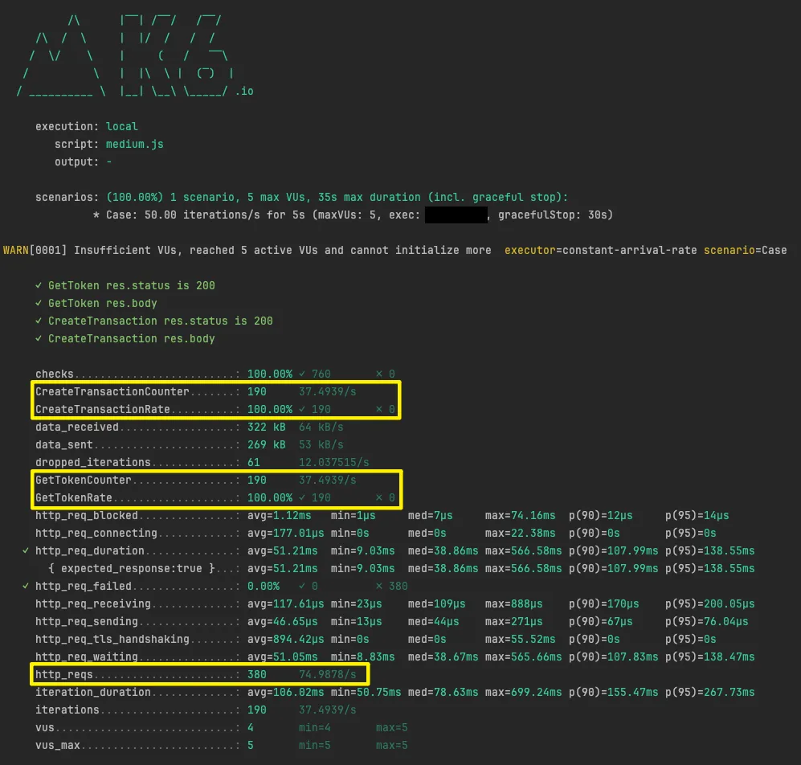
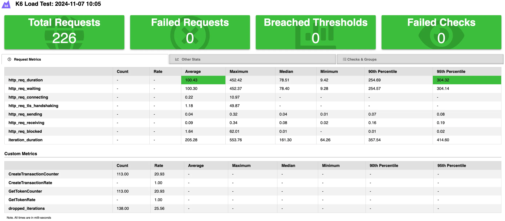

## My insights
Read my detailed insights on performance testing for the first time in this Medium article:  
[1st Time Performance Testing: Prioritizing, Preparing, and Perfecting](https://medium.com/@shyinlim/first-time-performance-testing-prioritizing-preparing-and-perfecting-417e9d1524ae)

-
# K6 API Performance Test

## Purpose
Using K6 do API Performance Testing.

## K6 Mac Installation
```shell
$ brew install k6
```

## K6 Test Execution
```shell
$ cd test_scirpt/featureXX
$ k6 run test_featureXX.js
```

## Test Result Example
- Terminal Result

- HTML Result

